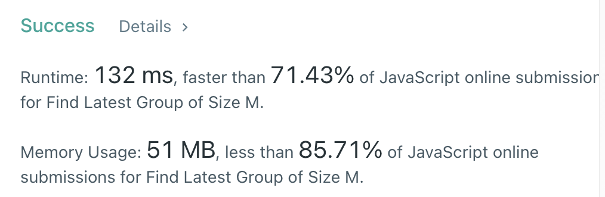

# leetcode - 1562. Find Latest Group of Size M

input

> arr = [3,5,1,2,4], m = 1

output

> 4

explanation

- Step 1: "00100", groups: ["1"]
- Step 2: "00101", groups: ["1", "1"]
- Step 3: "10101", groups: ["1", "1", "1"]
- Step 4: "11101", groups: ["111", "1"]
- Step 5: "11111", groups: ["11111"]
- The latest step at which there exists a group of size 1 is step 4.

<hr>

## Answer Code

```js
var findLatestStep = function (arr, m) {
  if (m === arr.length) return m;

  let reverseArr = new Array(arr.length + 1).fill(true);

  reverseArr[0] = false;
  // [0 ,1, 1, 1, 1, 1]

  let position, flag;

  for (let i = arr.length - 1; i >= 0; i--) {
    position = arr[i];
    reverseArr[position] = false;

    flag = true;
    // 현재 position 기준, 왼쪽으로 탐색
    for (let j = 1; j <= m; j++) {
      if (flag) flag = reverseArr[position - j];
      else break;
    }
    if (flag && !reverseArr[position - m - 1]) return i;

    flag = true;
    // 현재 position 기준, 오른쪽으로 탐색
    for (let j = 1; j <= m; j++) {
      if (flag) flag = reverseArr[position + j];
      else break;
    }
    if (flag && !reverseArr[position + m + 1]) return i;
  }
  return -1;
};
```

<hr/>

## Test Result


